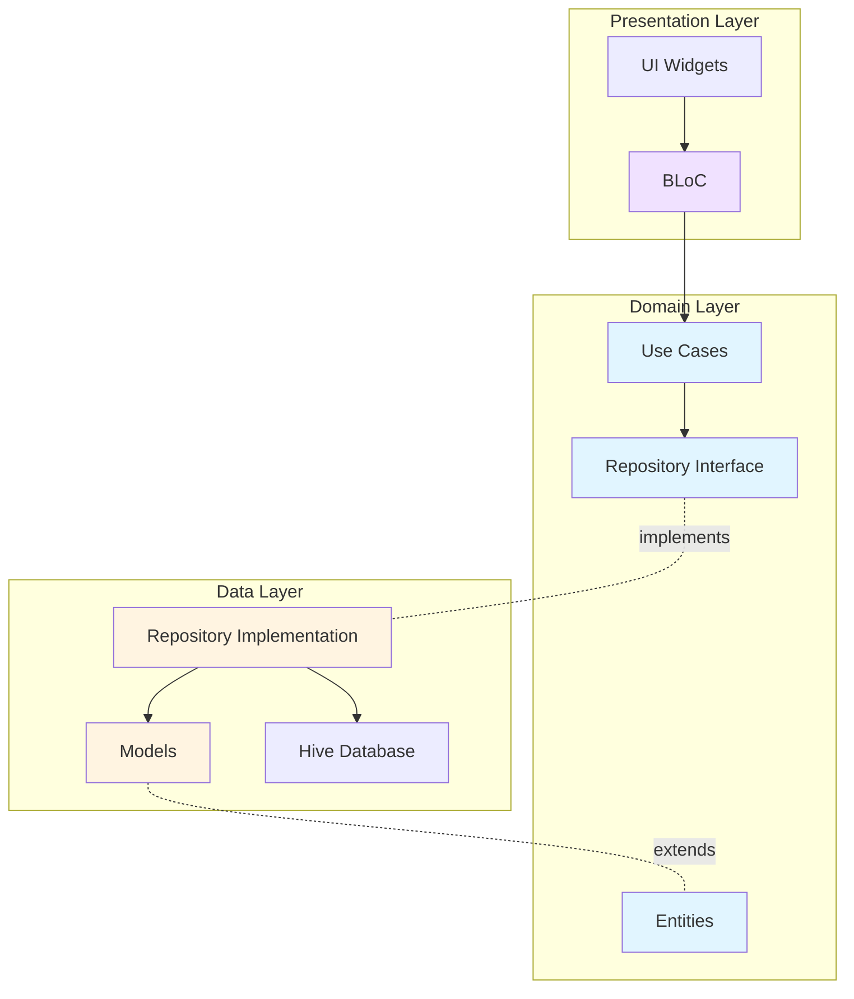
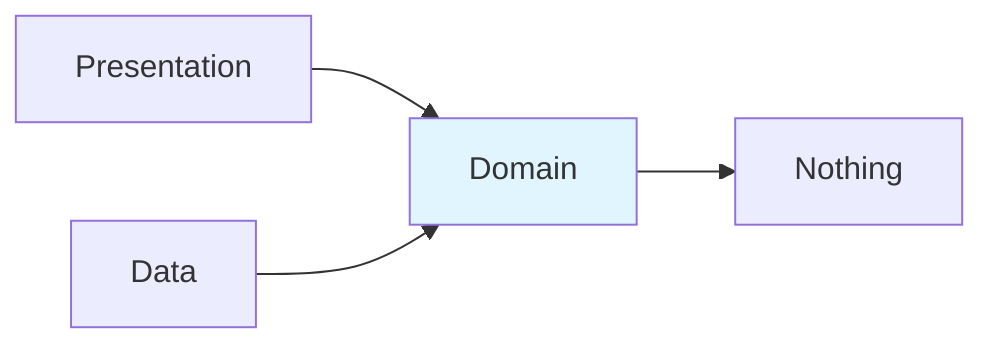

The Flutter Billing App implements Clean Architecture with a clear separation between domain, data, and presentation layers. This architecture ensures that business logic is independent of frameworks, UI, and external dependencies.

## Architecture Layers



## Layer Responsibilities

### Domain Layer
The core business logic layer, completely independent of external frameworks.

**Contains:**
- **Entities** - Business objects with identity
- **Repository Interfaces** - Contracts for data operations
- **Use Cases** - Single-responsibility business actions

**Dependencies:** None (pure Dart with only equatable for value equality)

### Data Layer
Implements data operations defined by the domain layer.

**Contains:**
- **Repository Implementations** - Concrete implementations of domain repositories
- **Models** - Data transfer objects that extend entities
- **Data Sources** - Direct access to storage (Hive)

**Dependencies:** Domain layer, Hive, fpdart

### Presentation Layer
Handles UI and user interactions.

**Contains:**
- **BLoCs** - Business Logic Components for state management
- **Pages** - Screen widgets
- **Widgets** - Reusable UI components

**Dependencies:** Domain layer, flutter_bloc

## Product Feature Example

Let's examine the Product feature structure at `lib/features/product/`:

### Domain Layer (`domain/`)

#### Entities
**File**: `domain/entities/product.dart:3-21`

```dart
class Product extends Equatable {
  final String id;
  final String name;
  final String barcode;
  final double price;
  final int stock;

  const Product({
    required this.id,
    required this.name,
    required this.barcode,
    required this.price,
    this.stock = 0,
  });

  @override
  List<Object?> get props => [id, name, barcode, price, stock];
}
```

Entities are pure Dart classes representing business concepts. They have no dependencies on Flutter or any external frameworks.

#### Repository Interface
**File**: `domain/repositories/product_repository.dart:5-11`

```dart
abstract class ProductRepository {
  Future<Either<Failure, List<Product>>> getProducts();
  Future<Either<Failure, Product>> getProductByBarcode(String barcode);
  Future<Either<Failure, void>> addProduct(Product product);
  Future<Either<Failure, void>> updateProduct(Product product);
  Future<Either<Failure, void>> deleteProduct(String id);
}
```

The repository interface defines the contract for data operations using the `Either` type for functional error handling.

#### Use Cases
**File**: `domain/usecases/product_usecases.dart:7-16`

```dart
class GetProductsUseCase implements UseCase<List<Product>, NoParams> {
  final ProductRepository repository;

  GetProductsUseCase(this.repository);

  @override
  Future<Either<Failure, List<Product>>> call(NoParams params) {
    return repository.getProducts();
  }
}
```

Each use case encapsulates a single business action. The use case depends on the repository interface, not the implementation.

**Other use cases** (same file):
- `AddProductUseCase` - Add new product
- `UpdateProductUseCase` - Update existing product
- `DeleteProductUseCase` - Delete product by ID
- `GetProductByBarcodeUseCase` - Find product by barcode

### Data Layer (`data/`)

#### Models
**File**: `data/models/product_model.dart:6-46`

```dart
@HiveType(typeId: 0)
class ProductModel extends Product {
  @override
  @HiveField(0)
  final String id;
  @override
  @HiveField(1)
  final String name;
  @override
  @HiveField(2)
  final String barcode;
  @override
  @HiveField(3)
  final double price;
  @override
  @HiveField(4)
  final int stock;

  const ProductModel({
    required this.id,
    required this.name,
    required this.barcode,
    required this.price,
    required this.stock,
  }) : super(
          id: id,
          name: name,
          barcode: barcode,
          price: price,
          stock: stock,
        );

  factory ProductModel.fromEntity(Product product) {
    return ProductModel(
      id: product.id,
      name: product.name,
      barcode: product.barcode,
      price: product.price,
      stock: product.stock,
    );
  }
}
```

Models extend entities and add serialization/persistence capabilities. The `@HiveType` and `@HiveField` annotations are used by code generation.

#### Repository Implementation
**File**: `data/repositories/product_repository_impl.dart:8-69`

```dart
class ProductRepositoryImpl implements ProductRepository {
  @override
  Future<Either<Failure, List<Product>>> getProducts() async {
    try {
      final box = HiveDatabase.productBox;
      final products = box.values.toList();
      return Right(products);
    } catch (e) {
      return Left(CacheFailure(e.toString()));
    }
  }

  @override
  Future<Either<Failure, void>> addProduct(Product product) async {
    try {
      final box = HiveDatabase.productBox;
      final model = ProductModel.fromEntity(product);
      await box.put(model.id, model);
      return const Right(null);
    } catch (e) {
      return Left(CacheFailure(e.toString()));
    }
  }

  // ... other methods
}
```

The implementation:
1. Converts domain entities to models for storage
2. Handles exceptions and wraps them in `Failure` objects
3. Returns `Either<Failure, T>` for type-safe error handling

### Presentation Layer (`presentation/`)

#### BLoC
**File**: `presentation/bloc/product_bloc.dart:10-26`

```dart
class ProductBloc extends Bloc<ProductEvent, ProductState> {
  final GetProductsUseCase getProductsUseCase;
  final AddProductUseCase addProductUseCase;
  final UpdateProductUseCase updateProductUseCase;
  final DeleteProductUseCase deleteProductUseCase;

  ProductBloc({
    required this.getProductsUseCase,
    required this.addProductUseCase,
    required this.updateProductUseCase,
    required this.deleteProductUseCase,
  }) : super(const ProductState()) {
    on<LoadProducts>(_onLoadProducts);
    on<AddProduct>(_onAddProduct);
    on<UpdateProduct>(_onUpdateProduct);
    on<DeleteProduct>(_onDeleteProduct);
  }
}
```

The BLoC depends on use cases, not repositories or data sources. See [State Management](/architecture/state-management) for details.

## Dependency Flow

Dependencies always point inward toward the domain layer:



### Dependency Rules

1. **Domain Layer** has no external dependencies (except utility packages like equatable)
2. **Data Layer** depends on Domain Layer interfaces
3. **Presentation Layer** depends on Domain Layer use cases
4. Domain Layer defines interfaces, outer layers provide implementations

## Boundaries Between Layers

### Domain ↔ Data Boundary

**Interface** (Domain):
```dart
abstract class ProductRepository {
  Future<Either<Failure, List<Product>>> getProducts();
}
```

**Implementation** (Data):
```dart
class ProductRepositoryImpl implements ProductRepository {
  @override
  Future<Either<Failure, List<Product>>> getProducts() async {
    // Implementation details
  }
}
```

The data layer can be swapped (e.g., from Hive to SQLite) without changing the domain layer.

### Domain ↔ Presentation Boundary

The presentation layer never directly accesses repositories. All business operations go through use cases:

```dart
// BLoC uses UseCase, not Repository
final result = await getProductsUseCase(NoParams());
```

This ensures business logic stays in the domain layer, not the presentation layer.

## Feature Structure Template

Every feature follows this structure:

```
features/<feature_name>/
├── domain/
│   ├── entities/          # Business objects
│   ├── repositories/      # Repository interfaces
│   └── usecases/         # Business logic
├── data/
│   ├── models/           # Data models (extend entities)
│   └── repositories/     # Repository implementations
└── presentation/
    ├── bloc/             # BLoC state management
    ├── pages/            # Screen widgets
    └── widgets/          # Feature-specific widgets
```

## Benefits of This Architecture

### 1. Testability
Each layer can be tested independently:
- Domain layer tests are pure unit tests
- Data layer can be tested with mock databases
- Presentation layer can be tested with mock use cases

### 2. Maintainability
Changes are localized:
- Change database? Only update data layer
- Change UI framework? Only update presentation layer
- Change business rules? Only update domain layer

### 3. Scalability
New features follow the same pattern:
- Clear structure reduces cognitive load
- Developers know where to find things
- New team members onboard faster

### 4. Independence
- Business logic doesn't depend on Flutter
- Can share domain layer across platforms
- Easy to migrate to new technologies

## Other Feature Examples

### Shop Feature
Follows the same structure at `lib/features/shop/`:
- Entity: `Shop` (name, address, phone)
- Use Cases: `GetShopUseCase`, `UpdateShopUseCase`
- Repository: `ShopRepository` → `ShopRepositoryImpl`
- BLoC: `ShopBloc`

### Billing Feature
Slightly simplified - no data layer as it's purely transient state:
- Entity: `CartItem`
- BLoC: `BillingBloc` (manages cart state)
- Uses: `GetProductByBarcodeUseCase` from Product feature

### Settings Feature
Manages printer configuration:
- Repository: `PrinterRepository` → `PrinterRepositoryImpl`
- BLoC: `PrinterBloc`
- No domain entities (handles hardware integration)

## Related Documentation

- [Architecture Overview](/architecture/overview) - High-level architecture
- [State Management](/architecture/state-management) - BLoC pattern details
- [Data Layer](/architecture/data-layer) - Repository and database implementation
