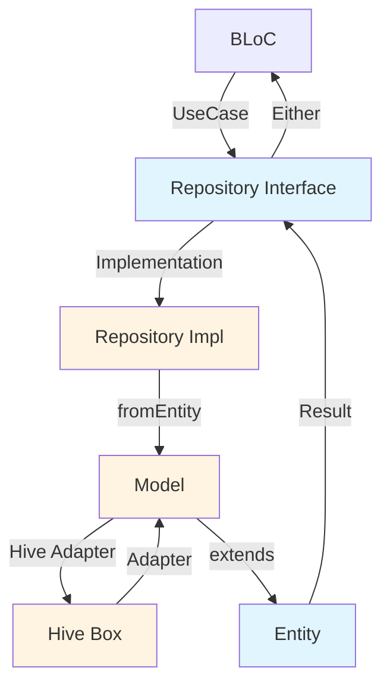

The Flutter Billing App uses **Hive** as its local database with a clean **Repository Pattern** to abstract data access. This architecture makes data sources swappable and keeps business logic independent of storage implementation.

## Technology Stack

### Hive Database

**Packages:**
- `hive: ^2.2.3` - Lightweight and fast NoSQL database
- `hive_flutter: ^1.1.0` - Flutter integration for Hive
- `hive_generator: ^2.0.1` - Code generator for type adapters

**Why Hive?**
- Fast read/write operations (pure Dart, no native code)
- Strongly typed with type adapters
- No setup required (no SQL, no migrations)
- Works offline by default
- Minimal app size overhead
- Perfect for POS apps with local-first data

### Code Generation

**Packages:**
- `json_serializable: ^6.7.1` - JSON serialization
- `build_runner: ^2.4.8` - Code generation tool

## Database Initialization

The database is initialized in `lib/core/data/hive_database.dart:5-27`:

```dart
class HiveDatabase {
  static const String productBoxName = 'products';
  static const String shopBoxName = 'shop';
  static const String settingsBoxName = 'settings';

  static Future<void> init() async {
    await Hive.initFlutter();

    // Register Adapters
    Hive.registerAdapter(ProductModelAdapter());
    Hive.registerAdapter(ShopModelAdapter());

    // Open Boxes
    await Hive.openBox<ProductModel>(productBoxName);
    await Hive.openBox<ShopModel>(shopBoxName);
    await Hive.openBox(settingsBoxName); // Generic box for simple key-value
  }

  static Box<ProductModel> get productBox =>
      Hive.box<ProductModel>(productBoxName);
  static Box<ShopModel> get shopBox => Hive.box<ShopModel>(shopBoxName);
  static Box get settingsBox => Hive.box(settingsBoxName);
}
```

### Initialization Steps:

1. **Initialize Hive** - `Hive.initFlutter()` sets up Hive with Flutter
2. **Register Adapters** - Type adapters for custom objects
3. **Open Boxes** - Boxes are like tables in SQL databases
4. **Provide Accessors** - Static getters for easy box access

This runs in `lib/main.dart:15` before the app starts:

```dart
void main() async {
  WidgetsFlutterBinding.ensureInitialized();
  await HiveDatabase.init(); // Initialize database
  await di.init();
  runApp(const MyApp());
}
```

## Hive Boxes

Hive uses "boxes" to store data. Each box is like a table:

| Box Name | Type | Purpose |
|----------|------|----------|
| `products` | `ProductModel` | Product catalog |
| `shop` | `ShopModel` | Shop information |
| `settings` | Generic | App settings (key-value) |

### Typed vs Generic Boxes

**Typed Box:**
```dart
Box<ProductModel> productBox = Hive.box<ProductModel>('products');
ProductModel product = productBox.get('id');
```

**Generic Box:**
```dart
Box settingsBox = Hive.box('settings');
String? printerMac = settingsBox.get('printer_mac');
```

Typed boxes enforce type safety. Generic boxes store any type (used for simple settings).

## Data Models

Models are data transfer objects that extend domain entities and add persistence capabilities.

### Product Model

**File**: `lib/features/product/data/models/product_model.dart:6-57`

```dart
@HiveType(typeId: 0)
class ProductModel extends Product {
  @override
  @HiveField(0)
  final String id;
  @override
  @HiveField(1)
  final String name;
  @override
  @HiveField(2)
  final String barcode;
  @override
  @HiveField(3)
  final double price;
  @override
  @HiveField(4)
  final int stock;

  const ProductModel({
    required this.id,
    required this.name,
    required this.barcode,
    required this.price,
    required this.stock,
  }) : super(
          id: id,
          name: name,
          barcode: barcode,
          price: price,
          stock: stock,
        );

  factory ProductModel.fromEntity(Product product) {
    return ProductModel(
      id: product.id,
      name: product.name,
      barcode: product.barcode,
      price: product.price,
      stock: product.stock,
    );
  }

  Product toEntity() {
    return Product(
      id: id,
      name: name,
      barcode: barcode,
      price: price,
      stock: stock,
    );
  }
}
```

### Model Annotations

**`@HiveType(typeId: 0)`**
- Marks class for Hive type adapter generation
- `typeId` must be unique across all models
- Used by `hive_generator` to create adapter code

**`@HiveField(index)`**
- Marks fields to be stored in Hive
- Index must be unique within the class
- Determines field order in storage

### Code Generation

The `part` directive includes generated code:

```dart
part 'product_model.g.dart';
```

Run code generation:

```bash
flutter pub run build_runner build --delete-conflicting-outputs
```

This generates `product_model.g.dart` with the type adapter:

```dart
class ProductModelAdapter extends TypeAdapter<ProductModel> {
  @override
  final int typeId = 0;

  @override
  ProductModel read(BinaryReader reader) {
    // Deserialization code
  }

  @override
  void write(BinaryWriter writer, ProductModel obj) {
    // Serialization code
  }
}
```

### Entity Conversion

Models provide methods to convert between data and domain layers:

**From Entity** (Domain → Data):
```dart
factory ProductModel.fromEntity(Product product) {
  return ProductModel(/* ... */);
}
```

**To Entity** (Data → Domain):
```dart
Product toEntity() {
  return Product(/* ... */);
}
```

This maintains layer boundaries - domain entities never depend on Hive.

## Repository Pattern

Repositories abstract data access and provide a clean API to the domain layer.

### Repository Interface (Domain Layer)

**File**: `lib/features/product/domain/repositories/product_repository.dart:5-11`

```dart
abstract class ProductRepository {
  Future<Either<Failure, List<Product>>> getProducts();
  Future<Either<Failure, Product>> getProductByBarcode(String barcode);
  Future<Either<Failure, void>> addProduct(Product product);
  Future<Either<Failure, void>> updateProduct(Product product);
  Future<Either<Failure, void>> deleteProduct(String id);
}
```

The interface:
- Defined in domain layer
- Returns domain entities (`Product`), not models
- Uses `Either` for functional error handling
- No mention of Hive or any specific storage

### Repository Implementation (Data Layer)

**File**: `lib/features/product/data/repositories/product_repository_impl.dart:8-69`

```dart
class ProductRepositoryImpl implements ProductRepository {
  @override
  Future<Either<Failure, List<Product>>> getProducts() async {
    try {
      final box = HiveDatabase.productBox;
      final products = box.values.toList();
      return Right(products);
    } catch (e) {
      return Left(CacheFailure(e.toString()));
    }
  }

  @override
  Future<Either<Failure, Product>> getProductByBarcode(String barcode) async {
    try {
      final box = HiveDatabase.productBox;
      final product = box.values.firstWhere(
        (element) => element.barcode == barcode,
        orElse: () => throw Exception('Product not found'),
      );
      return Right(product);
    } catch (e) {
      return Left(CacheFailure(e.toString()));
    }
  }

  @override
  Future<Either<Failure, void>> addProduct(Product product) async {
    try {
      final box = HiveDatabase.productBox;
      final model = ProductModel.fromEntity(product);
      await box.put(model.id, model); // Using ID as key
      return const Right(null);
    } catch (e) {
      return Left(CacheFailure(e.toString()));
    }
  }

  @override
  Future<Either<Failure, void>> updateProduct(Product product) async {
    try {
      final box = HiveDatabase.productBox;
      final model = ProductModel.fromEntity(product);
      await box.put(model.id, model);
      return const Right(null);
    } catch (e) {
      return Left(CacheFailure(e.toString()));
    }
  }

  @override
  Future<Either<Failure, void>> deleteProduct(String id) async {
    try {
      final box = HiveDatabase.productBox;
      await box.delete(id);
      return const Right(null);
    } catch (e) {
      return Left(CacheFailure(e.toString()));
    }
  }
}
```

### Implementation Details

#### Error Handling

Every method wraps operations in try-catch:

```dart
try {
  // Operation
  return Right(result);
} catch (e) {
  return Left(CacheFailure(e.toString()));
}
```

Errors are wrapped in `Failure` objects and returned as `Left` values.

#### Entity-Model Conversion

Repositories convert between layers:

**Incoming** (Domain → Data):
```dart
final model = ProductModel.fromEntity(product);
await box.put(model.id, model);
```

**Outgoing** (Data → Domain):
```dart
final products = box.values.toList(); // Already extends Product
return Right(products);
```

Since `ProductModel extends Product`, Hive boxes typed as `Box<ProductModel>` can return `List<Product>` directly.

## Hive Operations

### Create/Update

```dart
await box.put(key, value);
```

- If key exists, updates the value
- If key doesn't exist, creates new entry
- Key can be any type (usually String or int)

### Read

**Single Item:**
```dart
ProductModel? product = box.get('id');
```

**All Items:**
```dart
List<ProductModel> products = box.values.toList();
```

**Query:**
```dart
final product = box.values.firstWhere(
  (element) => element.barcode == barcode,
  orElse: () => throw Exception('Not found'),
);
```

### Delete

```dart
await box.delete(key);
```

### Clear All

```dart
await box.clear();
```

## Shop Repository Example

The Shop feature uses a similar pattern:

**File**: `lib/features/shop/data/repositories/shop_repository_impl.dart`

```dart
class ShopRepositoryImpl implements ShopRepository {
  @override
  Future<Either<Failure, Shop?>> getShop() async {
    try {
      final box = HiveDatabase.shopBox;
      if (box.isEmpty) {
        return const Right(null);
      }
      return Right(box.values.first);
    } catch (e) {
      return Left(CacheFailure(e.toString()));
    }
  }

  @override
  Future<Either<Failure, void>> updateShop(Shop shop) async {
    try {
      final box = HiveDatabase.shopBox;
      final model = ShopModel.fromEntity(shop);
      await box.clear(); // Only one shop
      await box.add(model);
      return const Right(null);
    } catch (e) {
      return Left(CacheFailure(e.toString()));
    }
  }
}
```

**Note:** Shop box stores a single entry (the shop info), so it clears before adding.

## Settings Repository

Settings uses a generic Hive box for simple key-value storage:

**Usage Example** (from `lib/features/billing/presentation/bloc/billing_bloc.dart:90`):

```dart
final savedMac = HiveDatabase.settingsBox.get('printer_mac');
if (savedMac != null) {
  await printerHelper.connect(savedMac);
}
```

**Saving Settings:**
```dart
await HiveDatabase.settingsBox.put('printer_mac', macAddress);
```

Generic boxes are perfect for:
- Configuration values
- Feature flags
- Last used settings
- Cached preferences

## Dependency Injection

Repositories are registered in the service locator:

**File**: `lib/core/service_locator.dart:48-66`

```dart
final sl = GetIt.instance;

Future<void> init() async {
  // Repository
  sl.registerLazySingleton<ProductRepository>(
    () => ProductRepositoryImpl(),
  );

  sl.registerLazySingleton<ShopRepository>(
    () => ShopRepositoryImpl(),
  );

  sl.registerLazySingleton<PrinterRepository>(
    () => PrinterRepositoryImpl(),
  );

  // ... use cases
}
```

### Registration Types

**Lazy Singleton:**
```dart
sl.registerLazySingleton<ProductRepository>(
  () => ProductRepositoryImpl(),
);
```
- Created once when first accessed
- Same instance reused throughout app
- Perfect for repositories (no state, just data access)

**Factory:**
```dart
sl.registerFactory(() => ProductBloc(/* ... */));
```
- New instance created each time
- Used for BLoCs (have state)

## Error Handling

The data layer defines failure types in `lib/core/error/failure.dart:3-13`:

```dart
abstract class Failure extends Equatable {
  final String message;
  const Failure(this.message);

  @override
  List<Object> get props => [message];
}

class CacheFailure extends Failure {
  const CacheFailure(String message) : super(message);
}
```

Repositories return `Either<Failure, T>`:

- **Success:** `Right(data)`
- **Failure:** `Left(CacheFailure(message))`

This approach:
- Makes errors explicit (no null or exceptions)
- Enforces error handling
- Provides clear error context

## Data Flow



1. **BLoC** calls **UseCase**
2. **UseCase** calls **Repository Interface**
3. **Repository Implementation** converts **Entity** to **Model**
4. **Model** serialized via **Hive Adapter**
5. **Hive Box** stores data
6. Read: reverse flow, model extends entity so no conversion needed
7. Result wrapped in **Either** and returned

## Best Practices

### 1. Models Extend Entities

```dart
class ProductModel extends Product {
  // Hive annotations
}
```

This allows:
- Type-safe box definitions: `Box<ProductModel>`
- Direct use as entities: `List<Product> = box.values.toList()`
- Clear data → domain conversion

### 2. Repository Returns Entities

Never expose models outside data layer:

```dart
// Good
Future<Either<Failure, List<Product>>> getProducts();

// Bad
Future<Either<Failure, List<ProductModel>>> getProducts();
```

### 3. Try-Catch All Operations

Always wrap Hive operations:

```dart
try {
  // Hive operation
  return Right(result);
} catch (e) {
  return Left(CacheFailure(e.toString()));
}
```

### 4. Use Unique Type IDs

Each model needs a unique `typeId`:

```dart
@HiveType(typeId: 0)  // ProductModel
@HiveType(typeId: 1)  // ShopModel
@HiveType(typeId: 2)  // NextModel
```

### 5. Use Unique Field IDs

Field indices must be unique within a class:

```dart
@HiveField(0) final String id;
@HiveField(1) final String name;
@HiveField(2) final String barcode;
```

### 6. Lazy Singletons for Repositories

Repositories should be singletons:

```dart
sl.registerLazySingleton<ProductRepository>(
  () => ProductRepositoryImpl(),
);
```

### 7. Initialize Before App Starts

Database must be initialized before any access:

```dart
void main() async {
  WidgetsFlutterBinding.ensureInitialized();
  await HiveDatabase.init(); // Critical!
  await di.init();
  runApp(const MyApp());
}
```

## Swapping Data Sources

The repository pattern makes it easy to swap data sources:

### Current (Hive):
```dart
sl.registerLazySingleton<ProductRepository>(
  () => ProductRepositoryImpl(), // Uses Hive
);
```

### Alternative (SQLite):
```dart
sl.registerLazySingleton<ProductRepository>(
  () => ProductRepositorySqliteImpl(), // Uses SQLite
);
```

### Remote (API):
```dart
sl.registerLazySingleton<ProductRepository>(
  () => ProductRepositoryRemoteImpl(client: sl()), // Uses HTTP
);
```

The domain layer never changes - only the data layer implementation.

## Performance Considerations

### Hive is Fast
- Pure Dart (no platform channels)
- Direct binary serialization
- In-memory caching
- Lazy loading

### Box Access is Cheap

```dart
final box = HiveDatabase.productBox; // Already open, instant access
```

No need to cache box references.

### Queries are Manual

Hive doesn't have a query language:

```dart
// Linear search
final product = box.values.firstWhere(
  (element) => element.barcode == barcode,
);
```

For complex queries or large datasets, consider:
- Indexing with multiple boxes
- Caching frequently accessed data
- Using SQLite for complex queries

## Related Documentation

- [Architecture Overview](/architecture/overview) - High-level architecture
- [Clean Architecture](/architecture/clean-architecture) - Layer structure and boundaries
- [State Management](/architecture/state-management) - BLoC pattern and use cases
