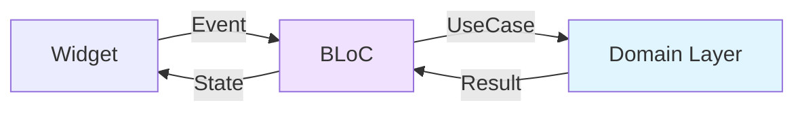
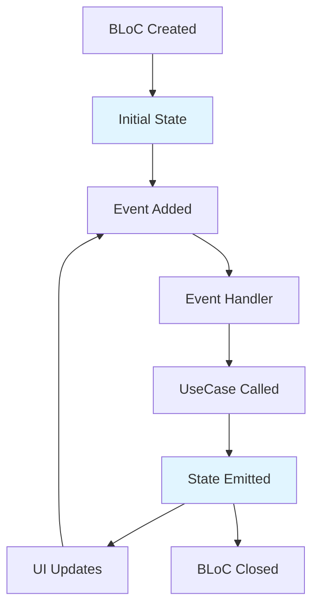

The Flutter Billing App uses the **BLoC (Business Logic Component)** pattern for state management, implemented with the `flutter_bloc` package. This approach separates business logic from UI and makes state predictable and testable.

## Why BLoC?

The BLoC pattern provides:

- **Separation of Concerns** - Business logic is separate from UI
- **Testability** - BLoCs can be tested without Flutter
- **Reusability** - Same BLoC can be used across multiple screens
- **Predictability** - State changes are explicit and traceable
- **Time Travel Debugging** - Easy to debug state transitions

## BLoC Pattern Overview



The flow:
1. UI dispatches an **Event** to BLoC
2. BLoC calls **Use Cases** from domain layer
3. BLoC receives result and emits new **State**
4. UI rebuilds based on new state

## BLoC Components

Every BLoC in the app consists of three parts:

### 1. Events
User actions or triggers that the BLoC responds to.

### 2. States
Representations of the UI state at any point in time.

### 3. BLoC
The business logic component that maps events to states.

## Product BLoC Example

Let's examine the Product feature BLoC at `lib/features/product/presentation/bloc/`:

### Events
**File**: `product_event.dart:3-31`

```dart
abstract class ProductEvent extends Equatable {
  const ProductEvent();

  @override
  List<Object> get props => [];
}

class LoadProducts extends ProductEvent {}

class AddProduct extends ProductEvent {
  final Product product;
  const AddProduct(this.product);
  @override
  List<Object> get props => [product];
}

class UpdateProduct extends ProductEvent {
  final Product product;
  const UpdateProduct(this.product);
  @override
  List<Object> get props => [product];
}

class DeleteProduct extends ProductEvent {
  final String id;
  const DeleteProduct(this.id);
  @override
  List<Object> get props => [id];
}
```

Events extend `Equatable` for value comparison. Each event represents a user action or system trigger.

### States
**File**: `product_state.dart:3-34`

```dart
enum ProductStatus { initial, loading, loaded, error, success }

class ProductState extends Equatable {
  final ProductStatus status;
  final List<Product> products;
  final String? message;

  const ProductState({
    this.status = ProductStatus.initial,
    this.products = const [],
    this.message,
  });

  ProductState copyWith({
    ProductStatus? status,
    List<Product>? products,
    String? message,
  }) {
    return ProductState(
      status: status ?? this.status,
      products: products ?? this.products,
      message: message,
    );
  }

  @override
  List<Object?> get props => [status, products, message];
}
```

The state uses an enum for status and includes all data needed by the UI. The `copyWith` method allows creating modified copies of the state.

### BLoC Implementation
**File**: `product_bloc.dart:10-87`

```dart
class ProductBloc extends Bloc<ProductEvent, ProductState> {
  final GetProductsUseCase getProductsUseCase;
  final AddProductUseCase addProductUseCase;
  final UpdateProductUseCase updateProductUseCase;
  final DeleteProductUseCase deleteProductUseCase;

  ProductBloc({
    required this.getProductsUseCase,
    required this.addProductUseCase,
    required this.updateProductUseCase,
    required this.deleteProductUseCase,
  }) : super(const ProductState()) {
    on<LoadProducts>(_onLoadProducts);
    on<AddProduct>(_onAddProduct);
    on<UpdateProduct>(_onUpdateProduct);
    on<DeleteProduct>(_onDeleteProduct);
  }

  Future<void> _onLoadProducts(
      LoadProducts event, Emitter<ProductState> emit) async {
    emit(state.copyWith(status: ProductStatus.loading));
    final result = await getProductsUseCase(NoParams());
    result.fold(
      (failure) => emit(state.copyWith(
          status: ProductStatus.error, message: failure.message)),
      (products) => emit(
          state.copyWith(status: ProductStatus.loaded, products: products)),
    );
  }

  Future<void> _onAddProduct(
      AddProduct event, Emitter<ProductState> emit) async {
    emit(state.copyWith(status: ProductStatus.loading));
    final result = await addProductUseCase(event.product);
    result.fold(
      (failure) => emit(state.copyWith(
          status: ProductStatus.error, message: failure.message)),
      (_) {
        emit(state.copyWith(
            status: ProductStatus.success,
            message: 'Product added successfully'));
        add(LoadProducts()); // Reload products
      },
    );
  }

  // ... similar implementations for update and delete
}
```

#### Key Points:

1. **Constructor** - Injects use cases via dependency injection
2. **Event Handlers** - Each `on<Event>` maps an event to a handler method
3. **State Emission** - `emit()` sends new states to the UI
4. **Async Operations** - Use cases return `Future<Either<Failure, T>>`
5. **Error Handling** - The `fold` method handles success and failure cases
6. **Cascading Events** - BLoCs can dispatch new events (e.g., reload after add)

## Billing BLoC Example

The Billing BLoC manages cart state and checkout flow:

**File**: `lib/features/billing/presentation/bloc/billing_bloc.dart:12-138`

```dart
class BillingBloc extends Bloc<BillingEvent, BillingState> {
  final GetProductByBarcodeUseCase getProductByBarcodeUseCase;

  BillingBloc({required this.getProductByBarcodeUseCase})
      : super(const BillingState()) {
    on<ScanBarcodeEvent>(_onScanBarcode);
    on<AddProductToCartEvent>(_onAddProductToCart);
    on<RemoveProductFromCartEvent>(_onRemoveProductFromCart);
    on<UpdateQuantityEvent>(_onUpdateQuantity);
    on<ClearCartEvent>(_onClearCart);
    on<PrintReceiptEvent>(_onPrintReceipt);
  }

  Future<void> _onScanBarcode(
      ScanBarcodeEvent event, Emitter<BillingState> emit) async {
    final result = await getProductByBarcodeUseCase(event.barcode);
    result.fold(
      (failure) =>
          emit(state.copyWith(error: 'Product not found: ${event.barcode}')),
      (product) {
        add(AddProductToCartEvent(product)); // Dispatch another event
      },
    );
  }

  void _onAddProductToCart(
      AddProductToCartEvent event, Emitter<BillingState> emit) {
    final existingIndex = state.cartItems
        .indexWhere((item) => item.product.id == event.product.id);
    if (existingIndex >= 0) {
      // Increase quantity
      final existingItem = state.cartItems[existingIndex];
      final updatedItems = List<CartItem>.from(state.cartItems);
      updatedItems[existingIndex] =
          existingItem.copyWith(quantity: existingItem.quantity + 1);
      emit(state.copyWith(cartItems: updatedItems, error: null));
    } else {
      // Add new item
      final newItem = CartItem(product: event.product);
      emit(state.copyWith(
          cartItems: [...state.cartItems, newItem], error: null));
    }
  }
}
```

This BLoC demonstrates:
- **Event Chaining** - One event triggers another (`ScanBarcode` → `AddToCart`)
- **Synchronous Handlers** - Not all handlers need to be async
- **State Manipulation** - Complex cart logic in pure Dart code

## BLoC Provider Setup

BLoCs are provided to the widget tree in `lib/main.dart:25-36`:

```dart
class MyApp extends StatelessWidget {
  const MyApp({super.key});

  @override
  Widget build(BuildContext context) {
    return MultiBlocProvider(
      providers: [
        BlocProvider<ProductBloc>(
            create: (context) => di.sl<ProductBloc>()..add(LoadProducts())),
        BlocProvider<ShopBloc>(
            create: (context) => di.sl<ShopBloc>()..add(LoadShopEvent())),
        BlocProvider<BillingBloc>(
            create: (context) =>
                BillingBloc(getProductByBarcodeUseCase: di.sl())),
        BlocProvider<PrinterBloc>(
            create: (context) => di.sl<PrinterBloc>()..add(InitPrinterEvent())),
      ],
      child: MaterialApp.router(
        title: 'Billing App',
        theme: AppTheme.lightTheme,
        routerConfig: router,
        debugShowCheckedModeBanner: false,
      ),
    );
  }
}
```

### Key Points:

1. **MultiBlocProvider** - Provides multiple BLoCs at the root
2. **GetIt Integration** - BLoCs retrieved from dependency injection container
3. **Initial Events** - Some BLoCs dispatch events immediately (e.g., `LoadProducts()`)
4. **Scope** - These BLoCs are available throughout the app

## Using BLoCs in UI

### BlocBuilder

Rebuilds UI when state changes:

```dart
BlocBuilder<ProductBloc, ProductState>(
  builder: (context, state) {
    if (state.status == ProductStatus.loading) {
      return CircularProgressIndicator();
    }
    if (state.status == ProductStatus.error) {
      return Text('Error: ${state.message}');
    }
    return ListView.builder(
      itemCount: state.products.length,
      itemBuilder: (context, index) {
        final product = state.products[index];
        return ListTile(title: Text(product.name));
      },
    );
  },
)
```

### BlocListener

Responds to state changes without rebuilding:

```dart
BlocListener<ProductBloc, ProductState>(
  listener: (context, state) {
    if (state.status == ProductStatus.success) {
      ScaffoldMessenger.of(context).showSnackBar(
        SnackBar(content: Text(state.message ?? 'Success')),
      );
    }
  },
  child: YourWidget(),
)
```

### BlocConsumer

Combines `BlocBuilder` and `BlocListener`:

```dart
BlocConsumer<ProductBloc, ProductState>(
  listener: (context, state) {
    // Side effects
    if (state.status == ProductStatus.error) {
      showErrorDialog(context, state.message);
    }
  },
  builder: (context, state) {
    // UI updates
    return YourWidget(products: state.products);
  },
)
```

### Dispatching Events

Use `context.read<BLoC>()` to access BLoC and add events:

```dart
// Add a product
context.read<ProductBloc>().add(
  AddProduct(Product(
    id: '1',
    name: 'New Product',
    barcode: '123456',
    price: 9.99,
  )),
);

// Reload products
context.read<ProductBloc>().add(LoadProducts());
```

## State Management Patterns

### 1. Status Enum Pattern

Used in ProductBloc and ShopBloc:

```dart
enum ProductStatus { initial, loading, loaded, error, success }
```

Benefits:
- Clear state representation
- Easy to handle in UI
- Type-safe status checks

### 2. Nullable Message Pattern

```dart
final String? message;
```

Messages are optional and transient (for success/error messages).

### 3. Immutable State Pattern

All state classes are immutable with `copyWith` methods:

```dart
ProductState copyWith({
  ProductStatus? status,
  List<Product>? products,
  String? message,
}) {
  return ProductState(
    status: status ?? this.status,
    products: products ?? this.products,
    message: message,
  );
}
```

### 4. Derived State Pattern

Some state values are computed from other state:

```dart
class BillingState extends Equatable {
  final List<CartItem> cartItems;

  double get totalAmount =>
      cartItems.fold(0, (sum, item) => sum + item.total);

  int get totalItems =>
      cartItems.fold(0, (sum, item) => sum + item.quantity);
}
```

## BLoC Testing

BLoCs are easy to test because they're independent of Flutter:

```dart
test('emits [loading, loaded] when LoadProducts succeeds', () async {
  // Arrange
  when(mockGetProductsUseCase(any))
      .thenAnswer((_) async => Right(mockProducts));

  // Assert later
  final expectedStates = [
    ProductState(status: ProductStatus.loading),
    ProductState(status: ProductStatus.loaded, products: mockProducts),
  ];

  expectLater(bloc.stream, emitsInOrder(expectedStates));

  // Act
  bloc.add(LoadProducts());
});
```

## Error Handling in BLoCs

All BLoCs use the `Either` type for error handling:

```dart
final result = await useCase(params);
result.fold(
  (failure) => emit(state.copyWith(
    status: Status.error,
    message: failure.message,
  )),
  (data) => emit(state.copyWith(
    status: Status.success,
    data: data,
  )),
);
```

Errors are:
1. Caught by use cases and wrapped in `Failure` objects
2. Passed to BLoCs as `Left(failure)`
3. Converted to error states
4. Displayed in UI

## BLoC Lifecycle



1. **Creation** - BLoC created by `BlocProvider`
2. **Initial State** - Set in constructor
3. **Event Processing** - Events added via `add()`
4. **State Emission** - New states emitted via `emit()`
5. **Cleanup** - `close()` called when BLoC disposed

## Best Practices

### 1. One BLoC per Feature
Each feature has its own BLoC (ProductBloc, BillingBloc, etc.).

### 2. Keep BLoCs Focused
Each BLoC handles a single concern. BillingBloc handles cart, not products.

### 3. Use Use Cases
BLoCs never directly access repositories - always go through use cases.

### 4. Immutable States
States are immutable. Use `copyWith` to create new states.

### 5. Descriptive Events
Event names clearly describe user actions: `AddProduct`, `DeleteProduct`.

### 6. Handle All States
UI should handle all possible states (initial, loading, error, success).

### 7. Clean Up Resources
Override `close()` if BLoC uses streams or other resources.

## Related Documentation

- [Architecture Overview](/architecture/overview) - High-level architecture
- [Clean Architecture](/architecture/clean-architecture) - Layer structure
- [Data Layer](/architecture/data-layer) - Repository and use case details
